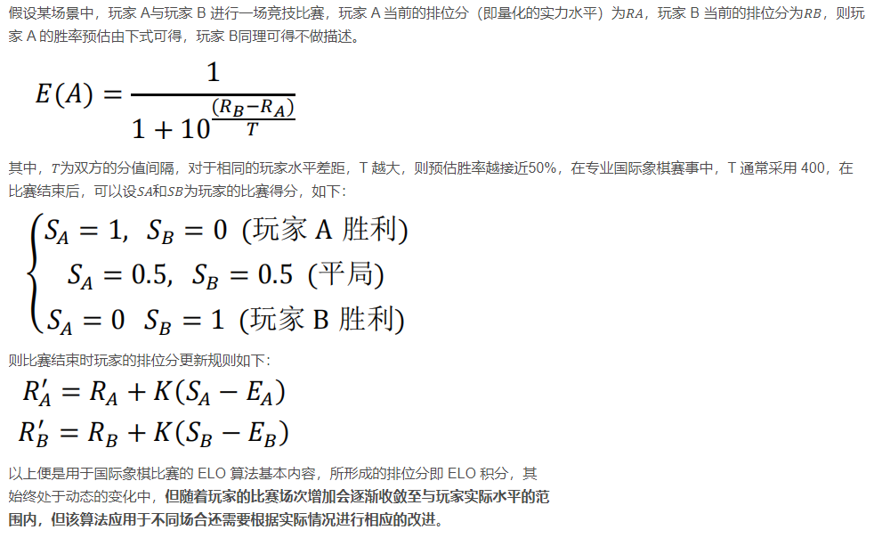

# 匹配机制

### 一、匹配系统基本条件

    每个人都有一个自己的天梯分

    每局匹配双方间分差不能超过设定值

    匹配时，如果匹配成功则返回对阵双方的匹配结果，否则返回空

    新手会得到特殊保护，通常新手仅仅会匹配到其它新手

### 二、匹配系统的目的：

· 公平，保证实力相当。

· 无需等待太久就能找到对手进入游戏。

### 三、实现思路1（以天梯分为标准进行匹配）

    1 匹配池按照 <分数，参与玩家> 的键值对建立红黑树
    
    2 每一个新玩家参与进来，将在匹配池寻找合适玩家
    
    3 匹配过程：在匹配池中选择预选玩家，选取规则：以当前新玩家天梯分值为参照，若找到分差不超过设定值A的对手，则直接匹配成功，
      否则继续寻找玩家，30秒内若找到分差在A和B之间的对手，则找到此范围内和该玩家分差最小的对手匹配；

    4 30秒结束时如果找不到符合条件的预选玩家，则把玩家重新放回匹配池并退出

### 实现思路2（以elo排位分为标准进行匹配，目标是撮合一个两方获胜几率都接近50%的对局）

    1 初始步骤同上
    
    2 开始匹配时，系统使用排位分来确定跟你很相近的合适的匹配对手（设置一个正负偏差值）尽量使两方的获胜几率接近50%。
      误差在3%之内即可——类似50/50，49/51，48/52。
      如果30秒匹配不到，则略微放宽匹配条件继续匹配。

    3 采用elo算法计算你和对手的下一次积分。

elo算法实现

***
    参考
    https://blog.csdn.net/LoveIsASea/article/details/51533681?ops_request_misc=%257B%2522request%255Fid%2522%253A%2522166493478216782412537429%2522%252C%2522scm%2522%253A%252220140713.130102334..%2522%257D&request_id=166493478216782412537429&biz_id=0&utm_medium=distribute.pc_search_result.none-task-blog-2~all~sobaiduend~default-3-51533681-null-null.142^v51^control,201^v3^control_2&utm_term=1v1%E5%8C%B9%E9%85%8D%E7%AE%97%E6%B3%95&spm=1018.2226.3001.4187
    https://blog.csdn.net/yekoufeng/article/details/80573857?ops_request_misc=&request_id=&biz_id=102&utm_term=%E7%8E%8B%E8%80%85%E8%8D%A3%E8%80%801v1%E5%8C%B9%E9%85%8D%E6%9C%BA%E5%88%B6&utm_medium=distribute.pc_search_result.none-task-blog-2~all~sobaiduweb~default-4-80573857.142^v51^control,201^v3^control_2&spm=1018.2226.3001.4187