# 匹配算法

## User 类

User 类具有如下属性：

| 名称     | 类型    | 描述         |
| -------- | ------- | ------------ |
| id       | String  | 用户ID       |
| rating   | Integer | 用户的排位分 |
| priority | Integer | 优先级       |

当玩家上一轮未匹配成功时，priority 被设置为1，即在下一轮优先匹配

## Couple 类

Couple 类中具有两个 User 类实体，封装了两个匹配在一起的用户

## ELO 算法

A 玩家的排位分为 RA，B 玩家的排位分为 RB 

A 玩家的胜率可由下式估算得：
$$
E(A)=\frac{1}{1+10^{\frac{RB-RA}{T}}}
$$
𝑇 为双方的分值间隔，对于相同的玩家水平差距，T  越大，则预估胜率越接近50%，两者的预估胜率差越接近于0，匹配越公平。在专业国际象棋赛事中，T  通常采用 400。在比赛结束后，可以设 𝑆𝐴 和 𝑆𝐵 为玩家的比赛得分，如下：
$$
SA=1，SB=0（A玩家胜利）\\

SA=0.5，SB=0.5（平局）\\

SA=0，SB=1（B玩家胜利）
$$
比赛结束时我们根据对局情况对玩家的排位分进行更新：
$$
RA'=RA+K(SA-EA)\\
RB'=RB+K(SB-EB)
$$
在大部分游戏中，K 值一般取32。

## 具体算法流程

1. 将当前参与排位匹配的玩家构成一个集合，即匹配池；
2. 将每个人按分数降序排序，排好序后，相邻玩家的排位分相差最小，选择相邻的两名玩家进行匹配；
3. 如果人数为偶数，刚好可以两两匹配，就不考虑上一轮没匹配的玩家获得的优先权，将玩家之前获得的优先权设置成0，接着第一名与第二名进行匹配，第三名与第四名进行匹配，以此类推，这样可以使得两个人的胜率差最小；
4. 如果人数为奇数，分别计算两两的预估胜率差，优先选择匹配胜率差最小的，将胜率差最小的两名玩家第一组匹配。此时匹配队列被划分成两个段，对每一段分人数为奇数还是偶数递归调用函数。两两配对后，肯定会剩下一名玩家没有配对，该名玩家在下一轮匹配中的优先级提高，priority 置1，即在下一轮优先匹配该玩家，此时匹配队列也被划分成两个段，对每一段分人数为奇数还是偶数递归调用函数。

## UML

