# 数据中心

数据中心主要负责各种数据的 CRUD 操作，向前端提供用户接口，并与模拟器对接执行游戏模拟、数据储存。

数据中心同时也是用户体验、UGC 处理的中心。

## 概要

主要包含以下几个模块：

- 用户管理
- 用户 AI （脚本）管理
- 游戏管理
- 地图市场
- 竞赛管理
- 排位系统
- 匹配系统

## RESTful 接口

### 请求

所有带有 `body` 的请求均为 `application/json`，参数均写在 `body` 内。

对于不带 `body` 的请求，参数以 `Query` 形式传递。

### 响应

HTTP 状态码成功时为 200 ，失败时可能为 401, 403, 404, 500 等。

响应 `body` 均为 `JSON` 格式，结构如下：

```ts
interface Response<T> {
  status: number;
  message?: string;
  data: T;
}
```

#### 状态码

当请求成功时，`status` 为 0，失败时为非 0 的整数。

#### 通用错误

| HTTP 状态码 |  状态码  |    说明    |
| :---------: | :------: | :--------: |
|    `404`    | `902000` | 内容不存在 |
|    `403`    | `902001` |  无权访问  |
|    `401`    | `902002` | 用户未登录 |
|    `400`    | `902003` |  参数错误  |
|    `409`    | `902004` | 内容已存在 |
|    `500`    | `902005` |  内部错误  |

#### UML


