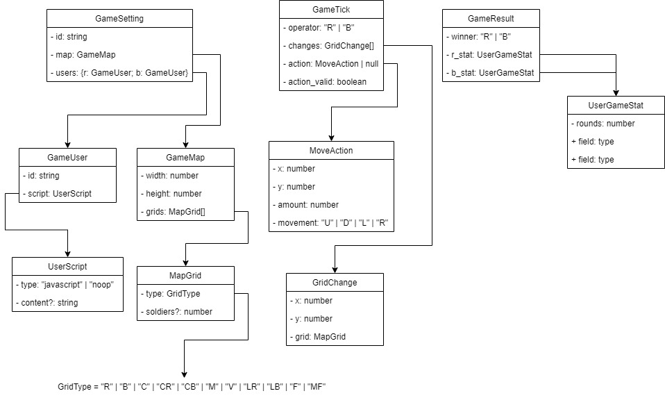
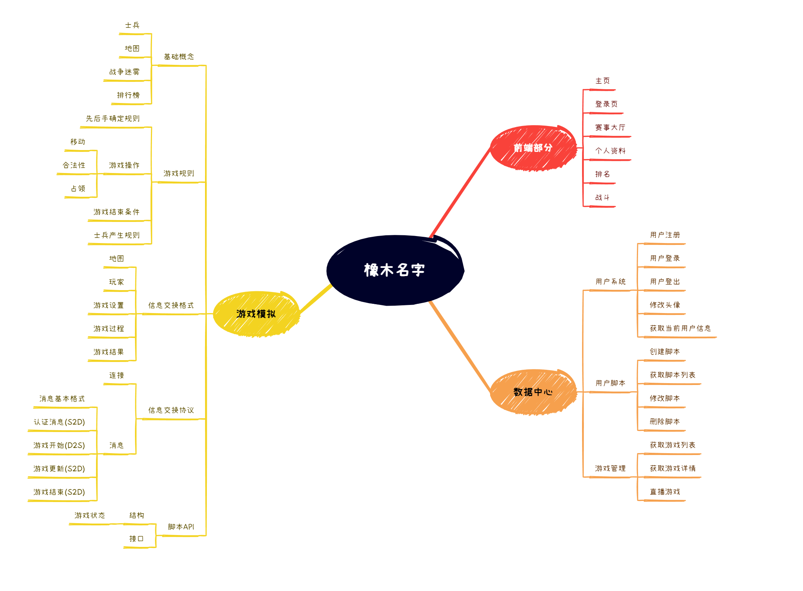
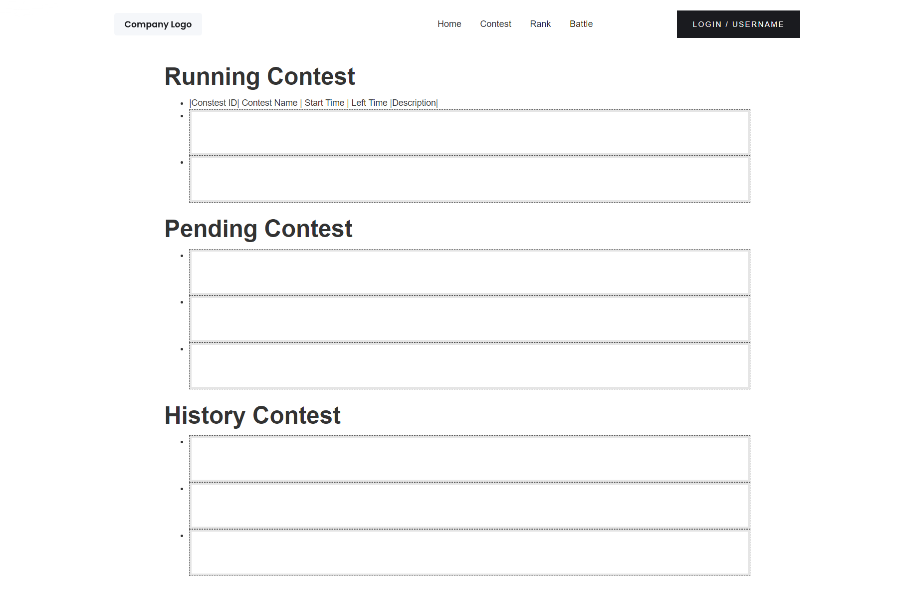
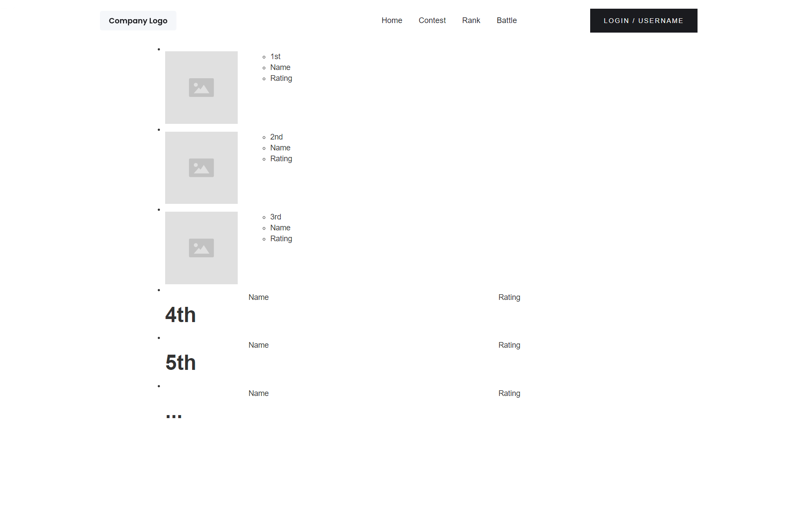
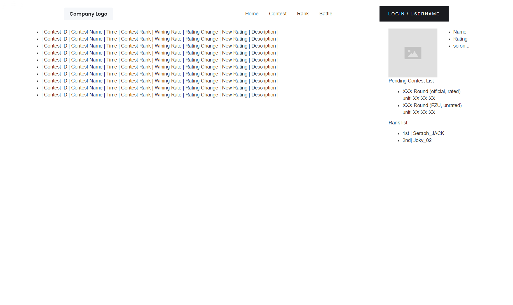
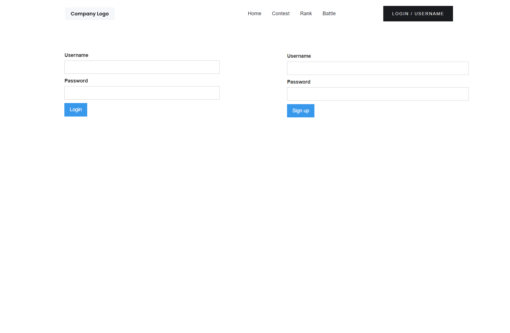

# 简介

## 选题背景

generals.io 是一款多人在线棋类游戏，玩家可以在游戏中控制自己的士兵，通过战斗来占领地图上的城堡、其他玩家的王冠等。

Valyria 是基于 generals.io 游戏规则在线 AI 对战平台，玩家需要通过脚本语言编写自己的 AI 程序，与其他玩家的 AI 程序进行对战。

通过编写 AI 脚本，玩家可以学习基础的编程知识，同时也可以学习到一些基础的游戏 AI 算法。

## 用户画像

Valyria 的用户画像是：

- 计算机相关领域专业的学生或者从业者。
- 对编程感兴趣的人或编程初学者。
- 对 AI 算法有一定兴趣或学习倾向。
- 有较为充裕的课余时间/业余时间编写 AI 脚本。

## 需求分析

对战平台主要分为三个部分：

- 前端：用户界面，提供用户交互。
- 数据中心：用于存储用户数据、脚本数据、对战数据等。
- 游戏模拟器：用于模拟游戏底层逻辑，提供对战数据。

## 竞品分析

与 generals.io 相比，Valyria 的亮点在于：

- 用户需要编写自己的 AI 脚本，而不是直接控制士兵，锻炼用户的算法基础能力。
- 添加了排位系统，玩家可以通过排位赛来提升自己的排名，提高了游戏的竞技性。
- 添加了地图市场功能，玩家可以自定义游戏地图，提高了游戏的自由度。
- 添加了匹配系统，通过玩家的排位匹配到旗鼓相当的对手，并对排名进行调整。

## 类图

## 思维导图

## 界面原型

### 主页

### 赛事大厅

### 排行榜

### 战斗历史

### 登录与注册

### 个人资料页

## 功能描述

Valyria 基于 generals.io 游戏规则，为玩家提供在线 AI 对战平台，玩家需要通过脚本语言编写自己的 AI 程序，与其他玩家的 AI 程序进行对战。

拟实现功能如下：

- generals.io 游戏底层逻辑。

- 提供排位系统以及排位赛功能。
允许玩家通过参加排位赛提高排名，增加趣味性。同时使用以匹配算法为核心的排位系统，使得玩家使用体验更加友好。
- 提供地图市场。
允许玩家自定义游戏地图，并将其开放共享，增加了游戏的自由度。
- 提供对局直播以及历史对局回放。
允许玩家在线观看正在进行的对局以及回放历史对局，能够更好改进自身 AI 算法。

## 验收验证标准

